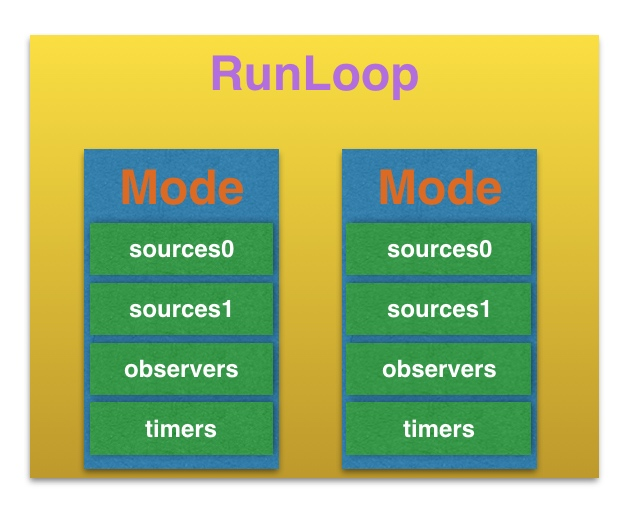
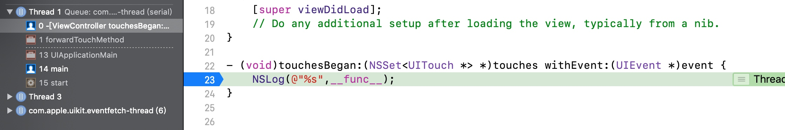

# Runloop

## 一. 什么是 RunLoop?

运行循环, 在程序运行的过程中循环的做一些事情.

## 二.应用范畴

- 定时器
- PerformSelector
- GCD Async Main Queue
- 事件响应
- 手势识别
- 界面刷新
- 网络请求
- AutoreleasePool

## 三.作用

- 保持程序的持续运行
- 处理 App 中的各种事件(如触摸事件、定时器事件等)
- 节省 CPU 资源, 提高程序性能;该做事时做事,该休息时休息.

## 四.获取 RunLoop 对象

`NSRunLoop` 和 `CFRunLoopRef` 都代表着 `RunLoop` 对象.且 `NSRunLoop` 是基于 `CFRunLoopRef` 的一层 OC 包装. `CFRunLoopRef` 是开源的.

[下载源码网址](https://opensource.apple.com/tarballs/CF)

- `Foundation` 框架
    - `NSRunLoop` 

- `Core Foundation` 框架
    - `CFRunLoopRef`

获取当前的 runloop

```objc
NSRunLoop *curRunLoop = [NSRunLoop currentRunLoop];

CFRunLoopRef curRunLoop2 = CFRunLoopGetCurrent();
```

## 五 RunLoop 与线程

- 每条线程都有`唯一的一个`与之对应的`RunLoop`对象.
- `RunLoop`保存在一个全局的`Dictionary`里, 线程是 `key`. `RunLoop`是`Value`.
- 线程刚创建时并没有`RunLoop`对象,`RunLoop`会在第一次获取它时创建.
- `RunLoop`会在线程结束时销毁.
- 主线程的`RunLoop`已经自动获取(创建),子线程默认没有开启`RunLoop`.               

## 六 RunLoop 相关的类

`Core Foundation` 中关于 `RunLoop` 的5个类:

- `CFRunLoopRef`
- `CFRunLoopModeRef`
- `CFRunLoopSourceRef`
- `CFRunLoopTimerRef`
- `CFRunLoopObserverRef`

### CFRunLoopRef 底层

```C++
typedef struct __CFRunLoop *CFRunLoopRef;
struct __CFRunLoop {
    pthread_t _pthread;
    CFMutableSetRef _commonModes;
    CFMutableSetRef _commonModeItems;
    CFRunLoopModeRef _currentMode;
    CFMutableSetRef _modes;
};
```

### CFRunLoopModeRef 代表 RunLoop 的运行模式

```C++
typedef struct __CFRunLoopMode *CFRunLoopModeRef;
struct __CFRunLoopMode {
    CFStringRef _name;
    CFMutableSetRef _sources0;
    CFMutableSetRef _sources1;
    CFMutableArrayRef _observers;
    CFMutableArrayRef _timers;
};
```

一个`RunLoop`中有几种`mode`.而每个 `mode` 中都包含上面结构体中的元素.且其中`只有一个mode`可以成为`currentMode`. 

- `sources0`
- `sources1`
- `observers`
- `timers`
 



`RunLoop`启动时只能选择其中一个`Mode`,作为`currentMode`.

如果需要切换`Mode`,只能退出当前`Loop`,再重新选择一个`Mode`进入.

- 不同组的 `sources0 / sources1 / Timer/ observers` 能分隔开来,互不影响.

如果`Mode`里没有任何 `sources0 / sources1 / Timer / observers`. `RunLoop`会立马退出.

#### 常见的两种 Mode

- `KCFRunLoopDefaultMode (NSDefaultRunLoopMode)`
    - App 的默认 `Mode`,通常主线程是在这个`Mode`下运行.
     
- `UITrackingRunLoopMode`
    - 界面跟踪 `Mode`, 用于 `scrollView` 追踪触摸滑动,保证界面滑动时不受其他 `Mode` 影响.

#### source0

1. `source0` 表示`触摸事件`的处理. 
2. `performSelector:onThread:`

执行 `touchesBegan:withEvent:` 方法.发现函数调用栈从1直接到13了.



调试区域输入`bt`.得到所有调用函数

```lldb
(lldb) bt
* thread #1, queue = 'com.apple.main-thread', stop reason = breakpoint 1.1
  * frame #0: 0x000000010df00704 RunLoopDemo1`-[ViewController touchesBegan:withEvent:](self=0x00007fd109601f50, _cmd="touchesBegan:withEvent:", touches=1 element, event=0x000060000303a520) at ViewController.m:23
    frame #1: 0x0000000111edcf01 UIKitCore`forwardTouchMethod + 353
    frame #2: 0x0000000111edcd8f UIKitCore`-[UIResponder touchesBegan:withEvent:] + 49
    frame #3: 0x000000011230b08f UIKitCore`-[UIWindow _sendTouchesForEvent:] + 2052
    frame #4: 0x000000011230ca30 UIKitCore`-[UIWindow sendEvent:] + 4080
    frame #5: 0x0000000111b12e10 UIKitCore`-[UIApplication sendEvent:] + 352
    frame #6: 0x0000000111a4b0d0 UIKitCore`__dispatchPreprocessedEventFromEventQueue + 3024
    frame #7: 0x0000000111a4dcf2 UIKitCore`__handleEventQueueInternal + 5948
    frame #8: 0x000000010f1e3b31 CoreFoundation`__CFRUNLOOP_IS_CALLING_OUT_TO_A_SOURCE0_PERFORM_FUNCTION__ + 17
    frame #9: 0x000000010f1e33a3 CoreFoundation`__CFRunLoopDoSources0 + 243
    frame #10: 0x000000010f1dda4f CoreFoundation`__CFRunLoopRun + 1263
    frame #11: 0x000000010f1dd221 CoreFoundation`CFRunLoopRunSpecific + 625
    frame #12: 0x00000001179351dd GraphicsServices`GSEventRunModal + 62
    frame #13: 0x0000000111af7115 UIKitCore`UIApplicationMain + 140
    frame #14: 0x000000010df007b0 RunLoopDemo1`main(argc=1, argv=0x00007ffee1cff020) at main.m:14
    frame #15: 0x0000000110be6551 libdyld.dylib`start + 1
```

发现这里有调用 `source0`.


#### source1

1. 基于 `Port` 的线程间通信
2. 系统事件捕捉

#### Timers

1. `NSTimer`
2. `performSelector:withObject:afterDelay`

#### Observers

1. 用来监听 `RunLoop`的状态
2. `UI`刷新(beforeWaiting 睡觉之前)
3. Autorelease pool (beforeWaiting 睡觉之前)


### CFRunLoopObserverRef

监听 RunLoop 状态:

```C++
// RunLoop Observer Activities:

typedef CF_OPTIONS(CFOptionFlags, CFRunLoopActivity) {
    KCFRunLoopEntry = (1UL << 0),               // 即将进入 Loop
    KCFRunLoopBeforeTimers = (1UL << 1),        // 即将处理 Timer
    KCFRunLoopBeforeSources = (1UL << 2),       // 即将处理 Source
    KCFRunLoopBeforeWaiting = (1UL << 5),       // 即将进入休眠
    KCFRunLoopAfterWaiting = (1UL << 6),        // 刚从休眠中唤醒
    KCFRunLoopExit = (1UL << 7),                // 即将退出 Loop
    KCFRunLoopAllActivities = 9x9FFFFFFFU       // 所有状态
};
```

处理点击事件和定时器事件:

点击屏幕后,先由`Source1`捕捉系统事件,然后 `Source1`会将这个事件包装成事件队列`EventQueue`, 然后`Source0` 处理这个事件队列.

```objc
- (void)viewDidLoad {
    [super viewDidLoad];
    
    
    /**
     观察者

    allocator#> 为新对象分配内存的分配器, 传 NULL 或 kCFAllocatorDefault description#>
    activities#> 标识运行循环的活动阶段的标志集，在此期间调用观察者 description#>
    repeats#> 观察者是否循环调用 description#>
    order#> 运行循环观察器的处理顺序 description#>
    observer  RunLoop 中的观察者
    activity RunLoop 当前状态
    return 观察者
     */
    CFRunLoopObserverRef observer = CFRunLoopObserverCreateWithHandler(kCFAllocatorDefault, kCFRunLoopAllActivities, YES, 0, ^(CFRunLoopObserverRef observer, CFRunLoopActivity activity) {
        
        switch (activity) {
                
            
            case kCFRunLoopEntry: {
                NSLog(@"即将进入 RunLoop");
            }
                
                break;
                
            case kCFRunLoopBeforeTimers: {
                NSLog(@"即将处理 Timer");
            }
                
                break;
                
            case kCFRunLoopBeforeSources: {
                NSLog(@"即将处理 Source");
            }
                
                break;
                
            case kCFRunLoopBeforeWaiting: {
                NSLog(@"即将进入休眠");
            }
                
                break;
                
            case kCFRunLoopAfterWaiting: {
                NSLog(@"刚从休眠中唤醒");
            }
                
                break;
                
            case kCFRunLoopExit: {
                NSLog(@"退出 RunLoop");
            }
                
                break;
                
                
                
            default:
                break;
        }
        
    });
    CFRunLoopAddObserver(CFRunLoopGetMain(), observer, kCFRunLoopCommonModes);
    CFRelease(observer);
    
}

- (void)touchesBegan:(NSSet<UITouch *> *)touches withEvent:(UIEvent *)event {
    NSLog(@"%s",__func__);
    
    [NSTimer scheduledTimerWithTimeInterval:3.0 repeats:NO block:^(NSTimer * _Nonnull timer) {
        NSLog(@"点击定时器--%s",__func__);
    }];
    
}

// 点击屏幕后,打印如下:
10:32:39.563987+0800 TYObserverRunLoopMode[12091:416602] 刚从休眠中唤醒
10:32:39.564455+0800 TYObserverRunLoopMode[12091:416602] 即将处理 Timer
10:32:39.564562+0800 TYObserverRunLoopMode[12091:416602] 即将处理 Source
10:32:39.566285+0800 TYObserverRunLoopMode[12091:416602] -[ViewController touchesBegan:withEvent:]
10:32:39.566589+0800 TYObserverRunLoopMode[12091:416602] 即将处理 Timer
10:32:39.566714+0800 TYObserverRunLoopMode[12091:416602] 即将处理 Source
...
...
10:32:39.626605+0800 TYObserverRunLoopMode[12091:416602] 即将进入休眠
10:32:42.567287+0800 TYObserverRunLoopMode[12091:416602] 刚从休眠中唤醒
10:32:42.567456+0800 TYObserverRunLoopMode[12091:416602] 点击定时器---[ViewController touchesBegan:withEvent:]_block_invoke
10:32:42.567617+0800 TYObserverRunLoopMode[12091:416602] 即将处理 Timer
10:32:42.567718+0800 TYObserverRunLoopMode[12091:416602] 即将处理 Source
...
```


切换模式


当处理滑动事件的时候,我们开始滑动到滑动结束这个过程,看下 mode 的变化.

上面的代码,只保留 Entry 和 Exit 即可.

```objc
- (void)viewDidLoad {
    [super viewDidLoad];
    
    
    /**
     观察者

    allocator#> 为新对象分配内存的分配器, 传 NULL 或 kCFAllocatorDefault description#>
    activities#> 标识运行循环的活动阶段的标志集，在此期间调用观察者 description#>
    repeats#> 观察者是否循环调用 description#>
    order#> 运行循环观察器的处理顺序 description#>
    observer  RunLoop 中的观察者
    activity RunLoop 当前状态
    return 观察者
     */
    CFRunLoopObserverRef observer = CFRunLoopObserverCreateWithHandler(kCFAllocatorDefault, kCFRunLoopAllActivities, YES, 0, ^(CFRunLoopObserverRef observer, CFRunLoopActivity activity) {
      
        switch (activity) {
                
            case kCFRunLoopEntry: {
                CFRunLoopMode mode = CFRunLoopCopyCurrentMode(CFRunLoopGetCurrent());
                CFRelease(mode);
                NSLog(@"即将进入 RunLoop --%@",mode);
            }
                
                break;
                         
            case kCFRunLoopExit: {
                CFRunLoopMode mode = CFRunLoopCopyCurrentMode(CFRunLoopGetCurrent());
                CFRelease(mode);
                NSLog(@"退出 RunLoop---%@",mode);
            }
                
                break;
                
                
                
            default:
                break;
        }
        
    });
    CFRunLoopAddObserver(CFRunLoopGetMain(), observer, kCFRunLoopCommonModes);
    CFRelease(observer);
    
}

// 滑动开始时,处于一直滑动的状态下,打印如下:
10:41:16.456223+0800 TYObserverRunLoopMode[12214:421044] 退出 RunLoop---kCFRunLoopDefaultMode
10:41:16.456514+0800 TYObserverRunLoopMode[12214:421044] 即将进入 RunLoop --UITrackingRunLoopMode

// 滑动松开手之后, mode 切换如下:
10:41:23.860593+0800 TYObserverRunLoopMode[12214:421044] 退出 RunLoop---UITrackingRunLoopMode
10:41:23.860761+0800 TYObserverRunLoopMode[12214:421044] 即将进入 RunLoop --kCFRunLoopDefaultMode

```

## 七. RunLoop 源码分析

通过简单的`touchesBegan:` 方法分析函数调用栈,可以找到RunLoop 的入口函数: `CFRunLoopRunSpecific`.

```lldb
* thread #1, queue = 'com.apple.main-thread', stop reason = breakpoint 1.1
  * frame #0: 0x000000010b5ee504 TYObserverRunLoopMode`-[ViewController touchesBegan:withEvent:](self=0x00007fd4b940b9d0, _cmd="touchesBegan:withEvent:", touches=1 element, event=0x0000600000aaa6d0) at ViewController.m:91
    frame #1: 0x000000010f5cbf01 UIKitCore`forwardTouchMethod + 353
    frame #2: 0x000000010f5cbd8f UIKitCore`-[UIResponder touchesBegan:withEvent:] + 49
    frame #3: 0x000000010f9fa08f UIKitCore`-[UIWindow _sendTouchesForEvent:] + 2052
    frame #4: 0x000000010f9fba30 UIKitCore`-[UIWindow sendEvent:] + 4080
    frame #5: 0x000000010f201e10 UIKitCore`-[UIApplication sendEvent:] + 352
    frame #6: 0x000000010f13a0d0 UIKitCore`__dispatchPreprocessedEventFromEventQueue + 3024
    frame #7: 0x000000010f13ccf2 UIKitCore`__handleEventQueueInternal + 5948
    frame #8: 0x000000010c8d2b31 CoreFoundation`__CFRUNLOOP_IS_CALLING_OUT_TO_A_SOURCE0_PERFORM_FUNCTION__ + 17
    frame #9: 0x000000010c8d23a3 CoreFoundation`__CFRunLoopDoSources0 + 243
    frame #10: 0x000000010c8cca4f CoreFoundation`__CFRunLoopRun + 1263
    frame #11: 0x000000010c8cc221 CoreFoundation`CFRunLoopRunSpecific + 625
    frame #12: 0x0000000114f3a1dd GraphicsServices`GSEventRunModal + 62
    frame #13: 0x000000010f1e6115 UIKitCore`UIApplicationMain + 140
    frame #14: 0x000000010b5ee640 TYObserverRunLoopMode`main(argc=1, argv=0x00007ffee4610fd8) at main.m:14
    frame #15: 0x000000010e2d5551 libdyld.dylib`start + 1
    frame #16: 0x000000010e2d5551 libdyld.dylib`start + 1
```

进入源码,看下 `CFRunLoopRunSpecific`这个函数做了什么事情, 原函数非常复杂,下面是去掉复杂部分,保留一些基本流程:

```C
SInt32 CFRunLoopRunSpecific(CFRunLoopRef rl, CFStringRef modeName, CFTimeInterval seconds, Boolean returnAfterSourceHandled) {     /* DOES CALLOUT */
    
    // 通知 observers, 进入 Loop
    __CFRunLoopDoObservers(rl, currentMode, kCFRunLoopEntry
    // 具体要做的事情
	result = __CFRunLoopRun(rl, currentMode, seconds, returnAfterSourceHandled, previousMode);
	 // 通知 observers, 退出 Loop
	__CFRunLoopDoObservers(rl, currentMode, kCFRunLoopExit
	
    return result;
}
```

看下`CFRunLoopRun`,看他具体在进入 Loop 后做了什么事情? 这个方法很复杂,但是我们可以看他里面有 `do...while`这部分.说明就是在循环做一些事情.

```c
do {
    
    ...    

} while (0 == retVal);
```

GCD很多时候是不依赖 RunLoop, 但是有一种情况依赖 RunLoop.

```objc
dispatch_async(dispatch_get_global_queue(0, 0), ^{
       
        dispatch_async(dispatch_get_main_queue(), ^{
            // 回到主线程做些刷新 UI 的操作,这里会执行 RunLoop 的
        });
        
    });
```

RunLoop中的休眠时线程都开始休眠了, CPU 不会再分配事情给这个线程做,直到被重新唤醒.那么这个休眠对应的代码就是下面这个:

```C
// 在 __CFRunLoopRun 这个方法中
static int32_t __CFRunLoopRun() {
    
    // ...
    // 等待别的消息来唤醒当前线程
    // 这个方法内部有个 `mach_msg`函数会调用一些内核的东西来达到线程休眠的状态
    __CFRunLoopServiceMachPort(waitSet, &msg, sizeof(msg_buffer), &livePort, poll ? 0 : TIMEOUT_INFINITY, &voucherState, &voucherCopy);
    // ...
    
}
```

这个代码的作用和 `while(1)` 这种循环阻塞不一样. `while(1)` 这种虽然能办到阻塞的作用,但是它的当前线程还在工作,要一直判断条件. 而 RunLoop 的这个阻塞休眠时线程真的休眠了,不做事情了.

## 八 滑动界面时,  NSTimer 失效的解决办法

将 `NSTimer` 的模式设置为 `NSRunLoopCommonModes`.

注意:

- `NSRunLoopCommonModes` 不是一个真正的模式,而是一个`标记`.
- `NSDefaultRunLoopMode` 和 `UITrackingRunLoopMode` 才是真正存在的模式.他们中都有个标记 `common`. 当指定`NSRunLoopCommonModes`这个标记时,二者都可以执行.

## Timer 和 RunLoop 的关系?

- 从数据结构上说, `__CFRunLoop`这个结构体里有个 mode. 里面放着 `_timers`.如果外面设置为 `CommonModes`的话,那么`Timer`也会被放到`_commonModeItems`这个数组中去.

```c
typedef stuct __CFRunLoop *CFRunLoopRef;
struct __CFRunLoop {
    pthread_t _pthread;
    CFMutableSetRef _commonModeModes;
    CFMutableSetRef _commonModeItems;
    CFRunLoopModeRef _currentMode;
    CFMutableSetRef _modes;
};

typedef struct __CFRunLoopMode *CFRunLoopModeRef;
struct __CFRunLoopMode {
    CFStringRef _name;
    CFMutableSetRef _sources0;
    CFMutableSetRef _sources1;
    CFMutableArrayRef _observers;
    CFMutableArrayRef _timers;
};
```

- 在 RunLoop 的执行流程中, Timer 也可以唤醒 RunLoop.

## 九 RunLoop 应用: 线程保活

创建一个子线程,我们想让他什么时候挂掉,就什么时候挂掉.

首先看下面这个写法,线程为什么会挂掉?

```Objc
// 继承 NSThread 创建一个自己的类 TYThread,并重写其 dealloc 方法监听其是否挂掉.
// 在 touchBegan: 方法中创建一个线程.

- (void)touchesBegan:(NSSet<UITouch *> *)touches withEvent:(UIEvent *)event {
    NSLog(@"开始点击屏幕");
    TYThread *thread = [[TYThread alloc] initWithTarget:self selector:@selector(runThread) object:nil];
    [thread start];
    
}

- (void)runThread {
    
    NSLog(@"%s == %@",__func__, [NSThread currentThread]);
    
    // 获取 RunLoop(获取就会创建好了)
    // 没有 source/Timer/Observer, RunLoop 会立马退出
    // 注意 : 调用 run 方法,是无法被停止的,这个 run 方法是专门用来开启一个永不销毁的线程的.
    [[NSRunLoop currentRunLoop] run];
    
}
```

上面的写法, `TYThread` 这个线程在执行完后还是会挂掉的. 虽然上面已经获取了 RunLoop. 但是因为没有 `Source/Timer/Observer` 等这些东西, RunLoop 会自动退出循环.

将上面的 `runThread` 方法改进, 这样就可以保证线程不会挂掉了.

```objc
- (void)runThread {
    
    NSLog(@"%s == %@",__func__, [NSThread currentThread]);
    
    // 添加 Source, 防止 RunLoop 退出
    [[NSRunLoop currentRunLoop] addPort:[[NSPort alloc] init] forMode:NSRunLoopCommonModes];
    
    // 获取 RunLoop(获取就会创建好了)
    // 没有 source/Timer/Observer, RunLoop 会立马退出
    [[NSRunLoop currentRunLoop] run];
    
}
```


